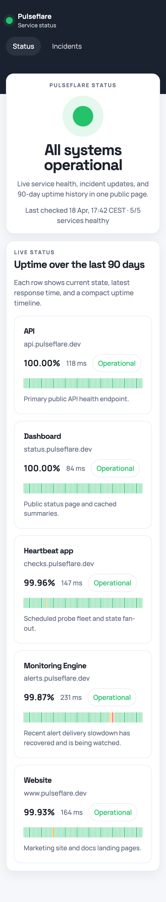

# Pulseflare

Uptime monitoring and a public status page for Cloudflare.

The intended install path is:

1. create a repo from this one
2. add Cloudflare credentials to GitHub
3. edit `config/pulse.config.ts`
4. push to `main`

GitHub Actions handles the Cloudflare deployment. You should not need Wrangler, Terraform, or manual SQL for the basic setup.

## What it looks like

The public page shows:

- current overall status
- service rows with status and response time
- 90-day uptime bars
- recent incidents and maintenance windows

The UI lives in `apps/web`. By default it is deployed as static assets on the same Worker that serves `/api/*`. A separate Cloudflare Pages deployment can be added later, but it is not needed for the default setup.




## Quickstart

### 1. Use this template

Create a new repository from this one.

### 2. Create a Cloudflare API token

Create a Cloudflare API token that can deploy Workers and manage D1.

Use:

- `Cloudflare Workers:Edit`
- `D1:Edit`

You also need the Cloudflare account ID:

1. Open the dashboard for your account
2. Select any domain or Workers project
3. In the right sidebar, look for `Account ID`
4. Copy that value

Cloudflare also includes it in many account URLs after `/accounts/`, but the sidebar is usually easier.

### 3. Add GitHub secrets

In your GitHub repo, add:

- `CLOUDFLARE_API_TOKEN`
- `CLOUDFLARE_ACCOUNT_ID`
- `PULSEFLARE_BOOTSTRAP_TOKEN` if you want to use the protected bootstrap endpoint

Optional GitHub repository variables:

- `PULSEFLARE_ENABLE_DEPLOY`
- `PULSEFLARE_WORKER_NAME`
- `PULSEFLARE_D1_NAME`
- `PULSEFLARE_CHECK_CRON`
- `PULSEFLARE_REMOTE_PROBE_URL`

Defaults:

- Deploy disabled
- Worker name: `pulseflare-status`
- D1 name: `pulseflare-d1`
- Check schedule: `* * * * *`
- Shared remote probe endpoint: unset

Deployment is disabled unless `PULSEFLARE_ENABLE_DEPLOY=true`. Leave it unset in repos that should only run tests and builds.

### 4. Edit the config

Edit [`config/pulse.config.ts`](config/pulse.config.ts) with your site name, services, maintenance windows, and notification settings.

You can start from [`config/pulse.example.ts`](config/pulse.example.ts).

### 5. Push to `main`

The workflow in [`.github/workflows/deploy.yml`](.github/workflows/deploy.yml):

- installs dependencies
- runs tests, build, and lint
- always runs the `verify` job
- only runs the `deploy` job when `PULSEFLARE_ENABLE_DEPLOY=true`
- finds or creates the D1 database
- applies D1 migrations
- deploys one Worker that serves both:
  - the public status site
  - the `/api/*` routes

The default install is one Worker with static assets, API routes, and a D1 binding.

Suggested guardrail:

- leave `PULSEFLARE_ENABLE_DEPLOY` unset in development or upstream repos
- set `PULSEFLARE_ENABLE_DEPLOY=true` only in the real deployment repo

More detail: [docs/deployment.md](docs/deployment.md).

## Cost

Cloudflare pricing that matters for this project, checked April 23, 2026:

- Workers Free: `100,000` requests per day, with `10 ms` CPU time per invocation included. [Workers pricing](https://developers.cloudflare.com/workers/platform/pricing/)
- Workers Static Assets: static asset requests are `free and unlimited`. [Workers pricing](https://developers.cloudflare.com/workers/platform/pricing/) and [Static assets best practices](https://developers.cloudflare.com/workers/best-practices/workers-best-practices/)
- D1 Free: `5 million` rows read per day, `100,000` rows written per day, and `5 GB` total storage. [D1 pricing](https://developers.cloudflare.com/d1/platform/pricing/)
- Workers Paid: minimum `$5/month`, with `10 million` included requests per month, then `$0.30` per additional million requests. [Workers pricing](https://developers.cloudflare.com/workers/platform/pricing/)

Expected cost for small installs:

- Most hobby and small-team installs should fit in the free tier.
- Costs depend on monitor count, check frequency, public traffic, and D1 usage.

The public page is served as Worker static assets. The Worker runs first for `/api/*`, not for every static page hit.

## Current scope

In the repo:

- checked-in config schema in [`config/pulse.config.ts`](config/pulse.config.ts)
- Worker routes
- D1 migrations
- canonical `/api/public/snapshot` API backed by live Worker state
- public summary API
- public services API backed by config and D1 state
- public incidents API backed by D1 state
- public maintenance API backed by config
- scheduled HTTP and TCP checks from config
- remote `region` and `proxy` probe execution
- D1-backed service status and incident transitions
- webhook notifications with grace-period handling
- persisted check history, uptime calculations, stale-state detection, and retention cleanup
- thresholded incident transitions with retryable webhook delivery
- public status UI bundled into the Worker deployment
- GitHub Actions deployment flow

The bootstrap endpoint accepts `POST /api/install/bootstrap` with an
`Authorization: Bearer <token>` header. Do not put the token in a URL query
parameter.
## Config example

```ts
import { defineStatusConfig } from '@pulseflare/schema'

export default defineStatusConfig({
  site: {
    name: 'Acme Status',
    description: 'System health and incident reporting',
    url: 'https://status.acme.dev',
    brand: {
      logo: '/brand/logo.svg',
      icon: '/brand/icon.svg',
    },
    navigation: [
      { label: 'Docs', href: 'https://acme.dev/docs' },
      { label: 'Support', href: 'https://acme.dev/support' },
    ],
  },
  services: [
    {
      id: 'api',
      name: 'Public API',
      group: 'Core Platform',
      failureThreshold: 2,
      recoveryThreshold: 2,
      checks: [
        {
          type: 'http',
          url: 'https://api.acme.dev/health',
          method: 'GET',
          expect: {
            status: [200],
            bodyIncludes: ['ok'],
          },
          probe: {
            kind: 'region',
            target: 'iad',
          },
        },
      ],
    },
  ],
  notifications: {
    gracePeriodMinutes: 5,
    providers: [
      {
        id: 'ops-webhook',
        type: 'webhook',
        url: 'https://hooks.acme.dev/pulseflare',
        method: 'POST',
        bodyTemplate: {
          source: 'pulseflare',
          event: '$EVENT',
          service: '$SERVICE_NAME',
          status: '$STATUS',
          reason: '$REASON',
        },
      },
    ],
  },
  staleAfterMinutes: 5,
  retentionDays: 90,
  maintenances: [],
})
```

More detail:

- [docs/configuration.md](docs/configuration.md)
- [docs/architecture.md](docs/architecture.md)
- [docs/deployment.md](docs/deployment.md)
- [docs/roadmap.md](docs/roadmap.md)

## Local development

Local tooling is for contributors:

```bash
npm install
npm run test
npm run build
npm run lint
```

For local Worker work:

```bash
npm run dev:worker
```

For local UI work:

```bash
npm run dev:web
```

## Contributing

Contributions are welcome, especially around:

- check execution
- incident persistence
- notification providers
- config ergonomics
- status-page polish
