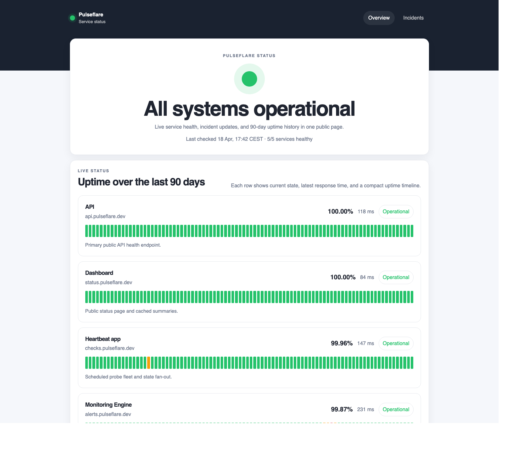

# Pulseflare

Open-source uptime monitoring and public status pages on Cloudflare:

1. Use this repo as a template
2. add two Cloudflare secrets in GitHub
3. edit one config file
4. push to `main`
5. GitHub Actions deploys the Worker and public status page

For normal installs, end users do not need local Wrangler, Terraform, or manual SQL steps.

## What it looks like

The public status page is designed to surface the most useful health information at a glance:

- one centered overall status summary
- stacked service rows with current state and response time
- compact 90-day uptime bars for each service
- recent incidents and maintenance history below the live status section

The UI is built in `apps/web` and deployed as static assets. In the default setup, those assets can be exposed through Cloudflare Pages while the Worker continues to serve the `/api/*` status routes.



## Quickstart

### 1. Use this template

Create your own repository from this project.

### 2. Create a Cloudflare API token

Create an API token in Cloudflare with permission to deploy Workers and manage D1.

In practice, give it:

- `Cloudflare Workers:Edit`
- `D1:Edit`

You also need your Cloudflare account ID.

### 3. Add GitHub secrets

In your GitHub repo, add:

- `CLOUDFLARE_API_TOKEN`
- `CLOUDFLARE_ACCOUNT_ID`

Optional GitHub repository variables:

- `PULSEFLARE_WORKER_NAME`
- `PULSEFLARE_D1_NAME`

If you do not set those variables, the workflow falls back to:

- Worker name: `pulseflare-status`
- D1 name: `pulseflare-d1`

### 4. Edit the config

Update [`config/pulse.config.ts`](config/pulse.config.ts) with your product name, services, maintenance windows, and notification settings.

### 5. Push to `main`

The deploy workflow at [`.github/workflows/deploy.yml`](.github/workflows/deploy.yml):

- installs dependencies
- runs tests, build, and lint
- finds or creates the D1 database
- applies D1 migrations
- deploys one Worker that serves both:
  - the public status site
  - the `/api/*` routes

That means the default install is now one Cloudflare project, not a separate Worker plus Pages setup.

## Cost

As of April 19, 2026, the Cloudflare pricing relevant to Pulseflare is:

- Workers Free: `100,000` requests per day, with `10 ms` CPU time per invocation included. [Workers pricing](https://developers.cloudflare.com/workers/platform/pricing/)
- Workers Static Assets: static asset requests are `free and unlimited`. [Workers pricing](https://developers.cloudflare.com/workers/platform/pricing/) and [Static assets best practices](https://developers.cloudflare.com/workers/best-practices/workers-best-practices/)
- D1 Free: `5 million` rows read per day, `100,000` rows written per day, and `5 GB` total storage. [D1 pricing](https://developers.cloudflare.com/d1/platform/pricing/)
- Workers Paid: minimum `$5/month`, with `10 million` included requests per month, then `$0.30` per additional million requests. [Workers pricing](https://developers.cloudflare.com/workers/platform/pricing/)

Expected cost:

- In most hobby, personal, and small-team installs, the free tier should be enough.
- That is the target cost profile for this project, and it should stay close to what UptimeFlare users expect.
- This is still an estimate, not a guarantee, because your real cost depends on monitor count, check frequency, public traffic, and D1 query patterns.

One helpful detail: the public status page is served as Worker static assets, while the Worker itself only runs first for `/api/*`. That keeps the public page on the cheaper static-asset path instead of counting every page hit as a Worker invocation.

## Current scope

Already in the repo:

- checked-in config schema in [`config/pulse.config.ts`](config/pulse.config.ts)
- Worker routes
- D1 migrations
- public summary API
- public status UI bundled into the Worker deploy path
- GitHub Actions deployment flow

Still in progress:

- real scheduled checks from config
- persistence-backed incidents and maintenance endpoints
- live notification delivery from state changes

## Config example

```ts
import { defineStatusConfig } from '@pulseflare/schema'

export default defineStatusConfig({
  site: {
    name: 'Acme Status',
    description: 'System health and incident reporting',
    url: 'https://status.acme.dev',
    brand: {
      logo: '/brand/logo.svg',
      icon: '/brand/icon.svg',
    },
    navigation: [
      { label: 'Docs', href: 'https://acme.dev/docs' },
      { label: 'Support', href: 'https://acme.dev/support' },
    ],
  },
  services: [
    {
      id: 'api',
      name: 'Public API',
      group: 'Core Platform',
      checks: [
        {
          type: 'http',
          url: 'https://api.acme.dev/health',
          method: 'GET',
          expect: {
            status: [200],
            bodyIncludes: ['ok'],
          },
        },
      ],
    },
  ],
  notifications: {
    gracePeriodMinutes: 5,
    providers: [],
  },
  maintenances: [],
})
```

More detail:

- [docs/configuration.md](docs/configuration.md)
- [docs/architecture.md](docs/architecture.md)

## Local development

Local tooling is for contributors:

```bash
npm install
npm run test
npm run build
npm run lint
```

For local Worker work:

```bash
npm run dev:worker
```

For local UI work:

```bash
npm run dev:web
```

## Contributing

Contributions are welcome, especially around:

- check execution
- incident persistence
- notification providers
- config ergonomics
- status-page polish
